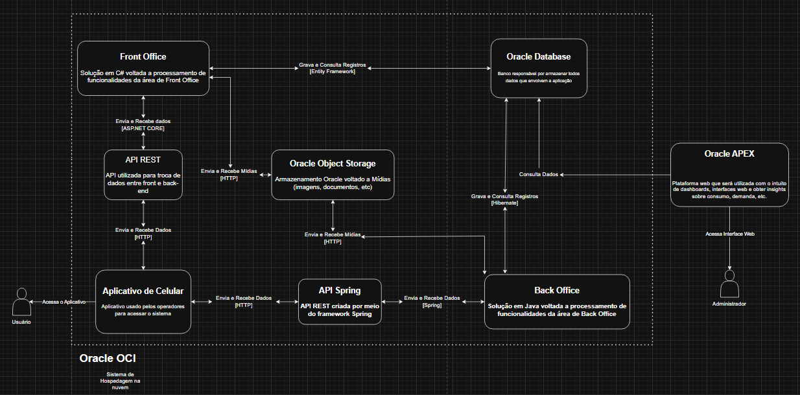

# MedSave: Sistema de Gestão de Medicamentos

## Definição do Projeto

### O que é o MedSave?

O **MedSave** é um sistema essencial proposto para modernizar e garantir a **segurança** na gestão de todo o fluxo de medicamentos da instituição. A proposta é transformar o **controle de estoque**, que hoje é propenso a falhas manuais, em um processo **digital, rastreável e confiável**.

O projeto atuará como o **coração da logística farmacêutica**, controlando o ciclo completo: desde a entrada de um produto no estoque até sua dispensação final ao paciente. O sistema garantirá que a gestão saiba exatamente **onde, quanto e até quando** cada medicamento pode ser utilizado, graças ao **registro detalhado por lote e data de validade**, evitando desperdícios e falhas no controle de validade, além de otimizar a alocação e redistribuição dos medicamentos entre diferentes unidades de saúde.
---
## 🏗️ Arquitetura e Tecnologia

A MedSave adota uma arquitetura moderna e escalável, utilizando o melhor de cada tecnologia:

* **Frontend & BI:** **Oracle Apex**
* **Backend & Microserviços:** **Java (Spring Boot)** e **C# (.NET 9 Web API)**
* **Mobile:** **React Native**
* **Banco de Dados:** **Oracle DB**
* **Cloud:** **Oracle Cloud Infrastructure**

A API em **.NET 9** segue uma arquitetura em **camadas**, com separação clara entre:
- **Domain Model (Entities)** → classes de domínio do banco Oracle.  
- **Repositories** → acesso a dados via Entity Framework Core.  
- **Services** → lógica de negócio, validações e tratamento de exceções.  
- **Controllers** → endpoints RESTful com suporte a **HATEOAS** (nível 3).  
- **DTOs (Data Transfer Objects)** → isolamento das entidades para transporte seguro de dados.  
---

## 🤝 Integrantes do Projeto

| Nome                                  | Função no Projeto          | LinkedIn | GitHub |
|---------------------------------------|----------------------------|----------|--------|
| Cleyton Enrike de Oliveira            | Desenvolvedor .NET & IOT   | [LinkedIn](https://www.linkedin.com/in/cleyton-enrike-de-oliveira99) | [@Cleytonrik99](https://github.com/Cleytonrik99) |
| Matheus Henrique Nascimento de Freitas| Desenvolvedor Mobile & DBA | [LinkedIn](https://www.linkedin.com/in/matheus-henrique-freitas)     | [@MatheusHenriqueNF](https://github.com/MatheusHenriqueNF) |
| Pedro Henrique Sena                   | Desenvolvedor Java & DevOps| [LinkedIn](https://www.linkedin.com/in/pedro-henrique-sena)          | [@devpedrosena1](https://github.com/devpedrosena1) |

---

## Escopo

O **MedSave** será desenvolvido como uma solução **full-stack**, utilizando **Oracle Database** para o armazenamento dos dados, **Oracle APEX** para a interface web e **React Native** para a interface móvel. O sistema terá as seguintes funcionalidades principais:

### Funcionalidades Principais

1. **Gestão de Usuários**:
   - Cadastro de operadores (com verificação de dados únicos, como e-mail e telefone).
   - Login de operadores.
   - Edição do cadastro, incluindo alteração de informações e senha.
   - Deleção de contas de usuários.

2. **Gestão de Estoque de Medicamentos**:
   - Cadastro de medicamentos, com informações como nome, quantidade, validade, etc.
   - Atualização da quantidade de medicamentos no estoque.
   - Rastreabilidade dos medicamentos por lote e data de validade.
   - Alertas para medicamentos próximos da validade.

3. **Movimentação de Medicamentos**:
   - Registros de entradas e saídas de medicamentos no estoque.
   - Transferências entre unidades de saúde.
   - Dispensação de medicamentos para pacientes.

4. **Inteligência Artificial (IA)**:
   - Previsão de demanda de medicamentos com base em dados históricos de consumo.
   - Análise de validade e otimização do estoque para evitar desperdícios.

O **MedSave** não incluirá funcionalidades de **gestão financeira**, **gestão de pacientes** ou **gestão de fornecedores** nesta fase inicial. Focaremos principalmente na gestão de medicamentos e na experiência do operador.

---

## Requisitos Funcionais e Não Funcionais

### Requisitos Funcionais

1. **Cadastro de Usuários**
2. **Login de Operadores**
3. **Gestão de Estoque**
4. **Movimentação de Medicamentos**
5. **Análise de Dados**

### Requisitos Não Funcionais

- **Desempenho e Escalabilidade**
- **Segurança e Manutenibilidade**
- **Compatibilidade entre Plataformas**
- **Usabilidade e Responsividade**

---

# 📡 API MedSave — Endpoints e Exemplos  
> Por padrão, a API roda em **http://localhost:5000**

---

## 👤 Users — `/api/UsersSys`

| Método | Endpoint | Descrição | Corpo da Requisição (JSON) | Resposta Esperada |
|--------|-----------|------------|-----------------------------|-------------------|
| **GET** | `/api/UsersSys` | Retorna todos os usuários cadastrados (com HATEOAS). | — | 200 OK com coleção e links de navegação. |
| **GET** | `/api/UsersSys/{id}` | Retorna um usuário específico pelo ID. | — | 200 OK com `_links` de ações possíveis ou 404 Not Found. |
| **POST** | `/api/UsersSys` | Cria um novo usuário e contato associado. | ```{ "usersSysDto": { "nameUser": "Maria Oliveira", "login": "maria.oli", "passwordUser": "senhaSegura123", "roleUserId": 2, "profUserId": 3 }, "contactUserDto": { "emailUser": "maria.oliveira@hospital.com", "phoneNumberUser": "11999887766" } } ``` | 201 Created (objeto criado + links) |
| **DELETE** | `/api/UsersSys/{id}` | Deleta um usuário existente. | — | 200 OK (mensagem + links) |
| **GET** | `/api/UsersSys/search` | Busca usuários com paginação e filtros. | — | 200 OK com `PagedResult` + `_links` de paginação. |

---

## 📦 Stock — `/api/Stock`

| Método  | Endpoint          | Descrição                                        | Corpo da Requisição (JSON)                                                                     | Resposta Esperada                 |
| ------- | ----------------- | ------------------------------------------------ | ---------------------------------------------------------------------------------------------- | --------------------------------- |
| **GET** | `/api/Stock`      | Retorna todos os registros de estoque (HATEOAS). | —                                                                                              | 200 OK com lista de `StockDTO`.   |
| **GET** | `/api/Stock/{id}` | Retorna um estoque específico pelo ID.           | —                                                                                              | 200 OK (objeto) ou 404 Not Found. |
| **PUT** | `/api/Stock/{id}` | Atualiza as informações de um estoque existente. | ```{ "stockId": 1, "medicineId": 3, "locationIdStock": 2, "batchId": 4, "quantity": 250 } ``` | 204 No Content ou 404 Not Found.  |
| **GET** | `/api/Stock/search` | Busca estoques filtrando por medicamento, lote ou local. | — | 200 OK (resultado paginado + links). |

OBS: No PUT, o operador atualiza apenas a **quantidade** — IDs não devem ser alterados no corpo.

---


---

## 🔍 Exemplos de Requisições **Search** (Filtros, Paginação e Ordenação)

### 👤 Users — `/api/UsersSys/search`

**Parâmetros suportados**
- `name` *(string, opcional)* — filtra por parte do nome
- `login` *(string, opcional)* — filtra por parte do login
- `roleUserId` *(long, opcional)* — filtra por perfil
- `profUserId` *(long, opcional)* — filtra por profissão
- `page` *(int, padrão: 1)* — página atual
- `pageSize` *(int, padrão: 10)* — itens por página (máx. 100)
- `sortBy` *(string, padrão: userId)* — campo de ordenação (ex.: `userId`, `nameUser`, `login`)
- `sortDir` *(string, padrão: asc)* — `asc` ou `desc`

**Exemplos**

- **Básico (padrão):**
  ```http
  GET http://localhost:5000/api/UsersSys/search?page=1&pageSize=10&sortBy=userId&sortDir=asc
  ```

- **Filtrar por nome e perfil:**
  ```http
  GET http://localhost:5000/api/UsersSys/search?name=Maria&roleUserId=2&page=1&pageSize=5&sortBy=nameUser&sortDir=asc
  ```

- **Login contém “oli”, ordenando por nome desc, página 2:**
  ```http
  GET http://localhost:5000/api/UsersSys/search?login=oli&page=2&pageSize=5&sortBy=nameUser&sortDir=desc
  ```

- **cURL (exemplo equivalente):**
  ```bash
  curl -X GET "http://localhost:5000/api/UsersSys/search?name=Maria&roleUserId=2&page=1&pageSize=5&sortBy=nameUser&sortDir=asc"
  ```

---

### 📦 Stock — `/api/Stock/search`

**Parâmetros suportados**
- `medicineId` *(long, opcional)* — filtra por medicamento
- `locationIdStock` *(long, opcional)* — filtra por local/almoxarifado
- `batchId` *(long, opcional)* — filtra por lote
- `page` *(int, padrão: 1)* — página atual
- `pageSize` *(int, padrão: 10)* — itens por página (máx. 100)
- `sortBy` *(string, padrão: stockId)* — campo de ordenação (ex.: `stockId`, `medicineId`, `quantity`)
- `sortDir` *(string, padrão: asc)* — `asc` ou `desc`

**Exemplos**

- **Básico (padrão):**
  ```http
  GET http://localhost:5000/api/Stock/search?page=1&pageSize=10&sortBy=stockId&sortDir=asc
  ```

- **Filtrar por medicamento e local:**
  ```http
  GET http://localhost:5000/api/Stock/search?medicineId=3&locationIdStock=2&page=1&pageSize=10&sortBy=quantity&sortDir=desc
  ```

- **Filtrar por lote específico (com ordenação asc):**
  ```http
  GET http://localhost:5000/api/Stock/search?batchId=15&sortBy=medicineId&sortDir=asc
  ```

- **cURL (exemplo equivalente):**
  ```bash
  curl -X GET "http://localhost:5000/api/Stock/search?medicineId=3&locationIdStock=2&page=1&pageSize=10&sortBy=quantity&sortDir=desc"
  ```

> **Resposta (modelo)**: os endpoints de busca retornam um `PagedResult` com `_links` de paginação (HATEOAS), por exemplo:
```json
{
  "items": [
    { "userId": 10, "nameUser": "Maria Oliveira", "login": "maria.oli", "roleUserId": 2, "profUserId": 3, "contactUserId": 7, "_links": [ /* ... */ ] }
  ],
  "pageInfo": { "page": 1, "pageSize": 5, "totalItems": 12, "totalPages": 3 },
  "_links": [
    { "rel": "self", "href": "/api/UsersSys/search?name=Maria&page=1&pageSize=5", "method": "GET" },
    { "rel": "next", "href": "/api/UsersSys/search?name=Maria&page=2&pageSize=5", "method": "GET" }
  ]
}
```

---
### 🧩 HATEOAS e Paginação

A API segue o **nível 3 de maturidade RESTful (HATEOAS)**, retornando `_links` com ações relacionadas:
```json
{
  "data": {
    "userId": 10,
    "nameUser": "Maria Oliveira"
  },
  "_links": [
    { "rel": "self", "href": "/api/UsersSys/10", "method": "GET" },
    { "rel": "delete", "href": "/api/UsersSys/10", "method": "DELETE" },
    { "rel": "list", "href": "/api/UsersSys", "method": "GET" }
  ]
}
```

---

### 🗃️ Diagrama de Entidade-Relacionamento (DER)
<div align="center">
  
</div>

---

### 🏗️ Desenho da Arquitetura
<div align="center">
  
</div>

---

## ⚙️ Como Rodar o Projeto

### Pré-requisitos

1. **.NET 9.0 SDK**
2. **Oracle Database + ODP.NET**
3. **Entity Framework Core com Oracle Provider**
4. **Visual Studio ou Rider (opcional, mas recomendado)**

---

### 🚀 Executando o Projeto

1. **Clone o repositório**
   ```bash
   git clone https://github.com/Cleytonrik99/MedSave---DotNet.git
   cd MedSave---DotNet
   ```

2. **Restaure as dependências**
   ```bash
   dotnet restore
   ```

3. **Compile o projeto**
   ```bash
   dotnet build
   ```

4. **Configure a conexão com o banco**
   - No `appsettings.json`, defina:
     ```json
     {
       "ConnectionStrings": {
         "DefaultConnection": "User Id=USUARIO;Password=SENHA;Data Source=HOST:PORTA/SERVICO"
       }
     }
     ```

5. **Atualize o banco de dados (opcional)**
   ```bash
   dotnet ef database update
   ```

6. **Execute o servidor**
   ```bash
   dotnet run
   ```
   O servidor iniciará em:
   ```
   http://localhost:5000
   ```

7. **Acesse o Swagger**
   Abra o navegador e vá até:
   ```
   http://localhost:5000/swagger
   ```
   Lá você poderá **testar todos os endpoints da API**, incluindo `GET`, `POST`, `PUT`, `DELETE` e `SEARCH`.

---
