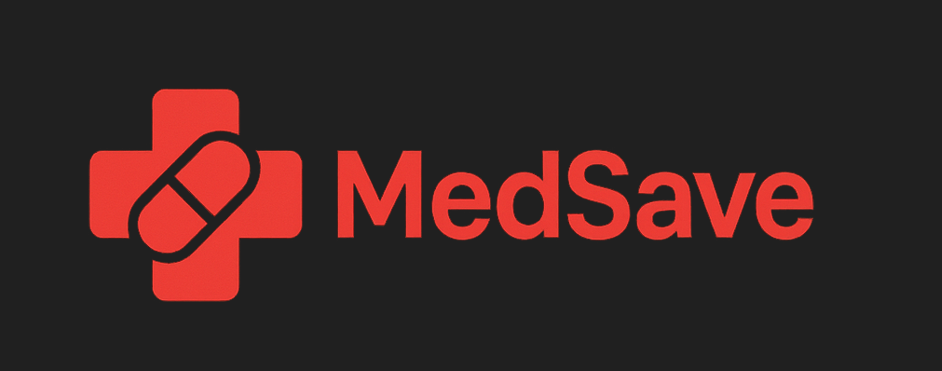
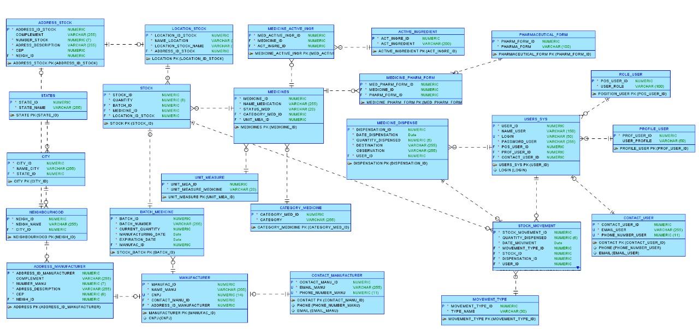

# MedSave: Sistema de Gestão de Medicamentos

## Definição do Projeto

### O que é o MedSave?

O **MedSave** é um sistema essencial proposto para modernizar e garantir a **segurança** na gestão de todo o fluxo de medicamentos da instituição. A proposta é transformar o **controle de estoque**, que hoje é propenso a falhas manuais, em um processo **digital, rastreável e confiável**.

O projeto atuará como o **coração da logística farmacêutica**, controlando o ciclo completo: desde a entrada de um produto no estoque até sua dispensação final ao paciente. O sistema garantirá que a gestão saiba exatamente **onde, quanto e até quando** cada medicamento pode ser utilizado, graças ao **registro detalhado por lote e data de validade**, evitando desperdícios e falhas no controle de validade, além de otimizar a alocação e redistribuição dos medicamentos entre diferentes unidades de saúde.
---
## 🏗️ Arquitetura e Tecnologia

A MedSave adota uma arquitetura moderna e escalável, utilizando o melhor de cada tecnologia:

* **Frontend & BI:** **Oracle Apex**
* **Backend & Microserviços:** **Java** e **C#**
* **Mobile:** **React Native**
* **Banco de Dados:** **Oracle DB**
* **Cloud:** **Oracle Cloud Infrastructure**
---

## 🤝 Integrantes do Projeto

| Nome                                  | Função no Projeto          | LinkedIn | GitHub |
|---------------------------------------|----------------------------|----------|--------|
| Cleyton Enrike de Oliveira            | Desenvolvedor .NET & IOT   | [LinkedIn](https://www.linkedin.com/in/cleyton-enrike-de-oliveira99) | [@Cleytonrik99](https://github.com/Cleytonrik99) |
| Matheus Henrique Nascimento de Freitas| Desenvolvedor Mobile & DBA | [LinkedIn](https://www.linkedin.com/in/matheus-henrique-freitas)     | [@MatheusHenriqueNF](https://github.com/MatheusHenriqueNF) |
| Pedro Henrique Sena                   | Desenvolvedor Java & DevOps| [LinkedIn](https://www.linkedin.com/in/pedro-henrique-sena)          | [@devpedrosena1](https://github.com/devpedrosena1) |

---

## Escopo

O **MedSave** será desenvolvido como uma solução **full-stack**, utilizando **Oracle Database** para o armazenamento dos dados, **Oracle APEX** para a interface web e **React Native** para a interface móvel. O sistema terá as seguintes funcionalidades principais:

### Funcionalidades Principais

1. **Gestão de Usuários**:
   - Cadastro de operadores (com verificação de dados únicos, como e-mail e telefone).
   - Login de operadores.
   - Edição do cadastro, incluindo alteração de informações e senha.
   - Deleção de contas de usuários.

2. **Gestão de Estoque de Medicamentos**:
   - Cadastro de medicamentos, com informações como nome, quantidade, validade, etc.
   - Atualização da quantidade de medicamentos no estoque.
   - Rastreabilidade dos medicamentos por lote e data de validade.
   - Alertas para medicamentos próximos da validade.

3. **Movimentação de Medicamentos**:
   - Registros de entradas e saídas de medicamentos no estoque.
   - Transferências entre unidades de saúde.
   - Dispensação de medicamentos para pacientes.

4. **Inteligência Artificial (IA)**:
   - Previsão de demanda de medicamentos com base em dados históricos de consumo.
   - Análise de validade e otimização do estoque para evitar desperdícios.

O **MedSave** não incluirá funcionalidades de **gestão financeira**, **gestão de pacientes** ou **gestão de fornecedores** nesta fase inicial. Focaremos principalmente na gestão de medicamentos e na experiência do operador.

---

## Requisitos Funcionais e Não Funcionais

### Requisitos Funcionais

1. **Cadastro de Usuários**:
   - O operador poderá se cadastrar informando dados como nome, e-mail, telefone e senha.
   - O sistema deverá verificar se o e-mail ou telefone já estão em uso.
   - O login do usuário será criado e deverá ser único.

2. **Login de Operadores**:
   - O operador poderá fazer login utilizando um nome de usuário (login) e senha previamente cadastrados.
   - O sistema validará as credenciais e fornecerá acesso ao painel de controle do operador.

3. **Gestão de Estoque**:
   - O operador poderá cadastrar novos medicamentos no sistema com dados como nome, descrição, quantidade e validade.
   - O operador poderá atualizar a quantidade de medicamentos disponíveis no estoque.
   - O sistema deverá gerar alertas para medicamentos que estão prestes a vencer.

4. **Movimentação de Medicamentos**:
   - O sistema deverá registrar entradas, saídas e transferências de medicamentos entre unidades.
   - O operador poderá dispensar medicamentos para pacientes.

5. **Análise de Dados**:
   - O sistema utilizará algoritmos de IA para prever a demanda de medicamentos, com base em dados históricos de consumo.
   - O sistema deverá sugerir movimentações para otimização do estoque.

### Requisitos Não Funcionais

1. **Desempenho**:
   - O sistema deverá ser capaz de lidar com grande volume de dados de medicamentos e movimentações, sem perda significativa de desempenho.
   - As consultas ao banco de dados devem ser rápidas e eficientes, especialmente nas telas de estoque e movimentação.

2. **Segurança**:
   - O sistema deve garantir que as senhas dos operadores sejam armazenadas de forma segura (uso de hash e salt).
   - O sistema deve garantir que apenas operadores autorizados possam acessar os dados relacionados ao estoque de medicamentos e movimentações.

3. **Escalabilidade**:
   - O sistema deverá ser capaz de crescer, permitindo a inclusão de novas unidades de saúde e medicamentos, sem comprometer a performance.
   - A arquitetura deve ser modular, permitindo que novas funcionalidades sejam adicionadas no futuro, como integração com fornecedores ou gestão financeira.

4. **Usabilidade**:
   - O sistema deve ser intuitivo, com interfaces claras e de fácil navegação tanto para a versão web (APEX) quanto para a versão móvel (React Native).
   - O design deve ser responsivo e adaptável a diferentes dispositivos e tamanhos de tela.

5. **Compatibilidade**:
   - O sistema será compatível com as versões mais recentes dos navegadores web e dispositivos móveis (iOS e Android).
   - A versão web será acessível por navegadores populares como Chrome, Firefox e Edge.

6. **Manutenibilidade**:
   - O código será estruturado de forma a permitir fácil manutenção e expansão.
   - O sistema será documentado adequadamente, com instruções claras sobre como adicionar novas funcionalidades ou corrigir erros.
---
# 📡 API MedSave — Endpoints e Exemplos - Por padrão rodará na porta http://localhost:5000
---

## 👤 Users — `/api/UsersSys`

| Método | Endpoint | Descrição | Corpo da Requisição (JSON) | Resposta Esperada |
|--------|-----------|------------|-----------------------------|-------------------|
| **GET** | `/api/UsersSys` | Retorna todos os usuários cadastrados. | — | 200 OK com lista de `UsersSysDTO`. |
| **GET** | `/api/UsersSys/{id}` | Retorna um usuário específico pelo ID. | — | 200 OK (objeto) ou 404 Not Found. |
| **POST** | `/api/UsersSys` | Cria um novo usuário junto com seu contato. | ```json { "usersSysDto": { "nameUser": "Maria Oliveira", "login": "maria.oli", "passwordUser": "senhaSegura123", "roleUserId": 2, "profUserId": 3 }, "contactUserDto": { "emailUser": "maria.oliveira@hospital.com", "phoneNumberUser": "11999887766" } } ``` | 201 Created (objeto criado) ou 400/409 se houver duplicidade. |
| **DELETE** | `/api/UsersSys/{id}` | Deleta um usuário existente. | — | 200 OK (mensagem de sucesso) ou 404 Not Found. |

### Exemplo de corpo de requisição
```bash 
{
   "usersSysDto": {
      "nameUser": "Maria Oliveira",
      "login": "maria.oli",
      "passwordUser": "senhaSegura123",
      "roleUserId": 2, "profUserId": 3 },
   "contactUserDto": {
      "emailUser": "maria.oliveira@hospital.com",
      "phoneNumberUser": "11999887766" }
}
```

---

## 📦 Stock — /api/Stock

| Método  | Endpoint          | Descrição                                        | Corpo da Requisição (JSON)                                                                     | Resposta Esperada                 |
| ------- | ----------------- | ------------------------------------------------ | ---------------------------------------------------------------------------------------------- | --------------------------------- |
| **GET** | `/api/Stock`      | Retorna todos os registros de estoque.           | —                                                                                              | 200 OK com lista de `StockDTO`.   |
| **GET** | `/api/Stock/{id}` | Retorna um estoque específico pelo ID.           | —                                                                                              | 200 OK (objeto) ou 404 Not Found. |
| **PUT** | `/api/Stock/{id}` | Atualiza as informações de um estoque existente. | `json { "stockId": 1, "medicineId": 3, "locationIdStock": 2, "batchId": 4, "quantity": 250 } ` | 204 No Content ou 404 Not Found.  |

OBS: Pelo intuito do PUT ser a ação de um operador atualizando apenas a quantidade do estoque, todas informações de id não devem ser alteradas no corpo.

### Exemplo de corpo de requisição
```bash
{
  "stockId": 15,
  "medicineId": 15,
  "locationIdStock": 2,
  "batchId": 15,
  "quantity": 10
}
```

---
### 🗃️ Diagrama de Entidade-Relacionamento (DER)

<div align="center">
  
</div>
---

## Como Rodar o Projeto

### Pré-requisitos

1. **.NET 9.0**:
   - Certifique-se de ter o **.NET 9.0 SDK** instalado em sua máquina.
   - Você pode verificar se o **.NET 9.0** está instalado executando o comando no terminal:
     ```bash
     dotnet --version
     ```
   - Se não estiver instalado, você pode obter a versão mais recente do .NET [aqui](https://dotnet.microsoft.com/download).

2. **Banco de Dados Oracle**:
   - O sistema utiliza **Oracle Database** para armazenar os dados. Você precisará de uma instância Oracle configurada e com as credenciais de acesso.
   - Certifique-se de que o **Oracle Data Provider for .NET** (ODP.NET) esteja instalado e configurado para permitir a comunicação com o banco de dados Oracle.
   - A conexão será configurada via **Entity Framework Core** para se conectar ao banco de dados Oracle.

3. **Entity Framework Core**:
   - O projeto utiliza **Entity Framework Core** para acesso ao banco de dados Oracle. O provedor de banco de dados Oracle deve ser configurado corretamente.
   - Se necessário, instale o pacote NuGet do **Oracle.EntityFrameworkCore**:
     ```bash
     dotnet add package Oracle.EntityFrameworkCore
     ```

### Rodando o Projeto

1. **Clone o Repositório**:
   - Clone o repositório do projeto para sua máquina local:
     ```bash
     git clone <(https://github.com/Cleytonrik99/MedSave---DotNet.git)>
     ```

2. **Instale as Dependências**:
   - Navegue até o diretório do projeto no terminal e execute o seguinte comando para restaurar as dependências:
     ```bash
     dotnet restore
     ```

3. **Configuração da Conexão com o Banco de Dados**:
   - Certifique-se de que a string de conexão do banco de dados Oracle esteja configurada corretamente no arquivo **appsettings.json** ou nas variáveis de ambiente, como mostrado abaixo:
     ```json
     {
       "ConnectionStrings": {
         "DefaultConnection": "User Id=<usuario>;Password=<senha>;Data Source=<host>:<porta>/<servico>"
       }
     }
     ```
   - Ajuste os valores de **usuario**, **senha**, **host**, **porta** e **serviço** conforme sua configuração do Oracle.

4. **Aplicando as Migrations**:
   - Se o banco de dados ainda não estiver configurado, você pode aplicar as migrations para criar as tabelas necessárias no banco de dados com o comando:
     ```bash
     dotnet ef database update
     ```
   - Isso irá aplicar as **migrations** criadas pelo Entity Framework e configurar o banco de dados conforme o modelo de dados.

5. **Executando o Projeto**:
   - Após a configuração, você pode executar o
