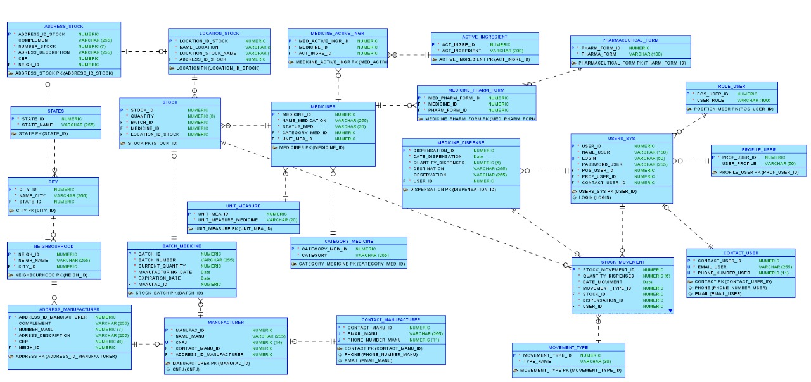
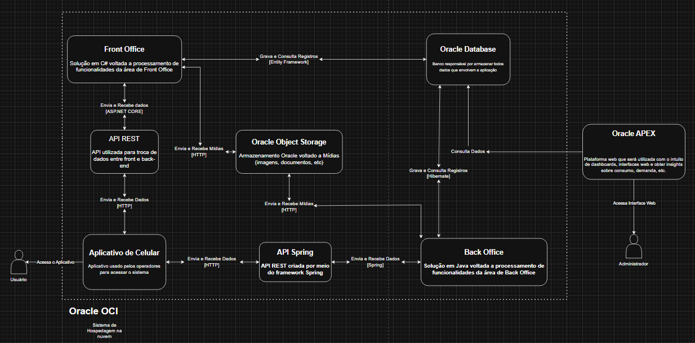

# MedSave: Sistema de Gestão de Medicamentos

## Definição do Projeto

### O que é o MedSave?

O **MedSave** é um sistema essencial proposto para modernizar e garantir a **segurança** na gestão de todo o fluxo de medicamentos da instituição. A proposta é transformar o **controle de estoque**, que hoje é propenso a falhas manuais, em um processo **digital, rastreável e confiável**.

O projeto atuará como o **coração da logística farmacêutica**, controlando o ciclo completo: desde a entrada de um produto no estoque até sua dispensação final ao paciente. O sistema garantirá que a gestão saiba exatamente **onde, quanto e até quando** cada medicamento pode ser utilizado, graças ao **registro detalhado por lote e data de validade**, evitando desperdícios e falhas no controle de validade, além de otimizar a alocação e redistribuição dos medicamentos entre diferentes unidades de saúde.

Além das funcionalidades de negócio, a solução também conta com recursos de **monitoramento e observabilidade**, como **Health Checks**, **logging estruturado com Serilog** e **telemetria com OpenTelemetry integrada ao Azure Monitor**, bem como **testes automatizados** para validação da aplicação.

---

## 🏗️ Arquitetura e Tecnologia

A MedSave adota uma arquitetura moderna e escalável, utilizando o melhor de cada tecnologia:

* **Frontend & BI:** **Oracle Apex**
* **Backend & Microserviços:** **Java (Spring Boot)** e **C# (.NET 9 Web API)**
* **Mobile:** **React Native**
* **Banco de Dados:** **Oracle DB**
* **Cloud:** **Oracle Cloud Infrastructure**

A API em **.NET 9** segue uma arquitetura em **camadas**, com separação clara entre:
- **Domain Model (Entities)** → classes de domínio do banco Oracle.
- **Repositories** → acesso a dados via Entity Framework Core.
- **Services** → lógica de negócio, validações e tratamento de exceções.
- **Controllers** → endpoints RESTful responsáveis por expor a API, receber requisições e retornar respostas HTTP adequadas.
- **DTOs (Data Transfer Objects)** → isolamento das entidades para transporte seguro de dados.

---

## 🤝 Integrantes do Projeto

| Nome | Função no Projeto | LinkedIn | GitHub |
|---|---|---|---|
| Cleyton Enrike de Oliveira | Desenvolvedor .NET & IOT | [LinkedIn](https://www.linkedin.com/in/cleyton-enrike-de-oliveira99) | [@Cleytonrik99](https://github.com/Cleytonrik99) |
| Matheus Henrique Nascimento de Freitas | Desenvolvedor Mobile & DBA | [LinkedIn](https://www.linkedin.com/in/matheus-henrique-freitas) | [@MatheusHenriqueNF](https://github.com/MatheusHenriqueNF) |
| Pedro Henrique Sena | Desenvolvedor Java & DevOps | [LinkedIn](https://www.linkedin.com/in/pedro-henrique-sena) | [@devpedrosena1](https://github.com/devpedrosena1) |

---

## Escopo

O **MedSave** será desenvolvido como uma solução **full-stack**, utilizando **Oracle Database** para o armazenamento dos dados, **Oracle APEX** para a interface web e **React Native** para a interface móvel. O sistema terá as seguintes funcionalidades principais:

### Funcionalidades Principais

1. **Gestão de Usuários**:
    - Cadastro de operadores (com verificação de dados únicos, como e-mail e telefone).
    - Login de operadores.
    - Edição do cadastro, incluindo alteração de informações e senha.
    - Deleção de contas de usuários.

2. **Gestão de Estoque de Medicamentos**:
    - Cadastro de medicamentos, com informações como nome, quantidade, validade, etc.
    - Atualização da quantidade de medicamentos no estoque.
    - Rastreabilidade dos medicamentos por lote e data de validade.
    - Alertas para medicamentos próximos da validade.

3. **Movimentação de Medicamentos**:
    - Registros de entradas e saídas de medicamentos no estoque.
    - Transferências entre unidades de saúde.
    - Dispensação de medicamentos para pacientes.

4. **Inteligência Artificial (IA)**:
    - Previsão de demanda de medicamentos com base em dados históricos de consumo.
    - Análise de validade e otimização do estoque para evitar desperdícios.

5. **Monitoramento e Observabilidade**:
    - Endpoints de Health Check para verificação da saúde da aplicação.
    - Logging estruturado com níveis de severidade.
    - Telemetria e monitoramento com OpenTelemetry e Azure Monitor.

6. **Testes Automatizados**:
    - Testes unitários e de integração para validação das regras de negócio e endpoints da API.
    - Execução automatizada com `dotnet test`.

O **MedSave** não incluirá funcionalidades de **gestão financeira**, **gestão de pacientes** ou **gestão de fornecedores** nesta fase inicial. Focaremos principalmente na gestão de medicamentos e na experiência do operador.

---

## Requisitos Funcionais e Não Funcionais

### Requisitos Funcionais

1. **Cadastro de Usuários**
2. **Login de Operadores**
3. **Gestão de Estoque**
4. **Movimentação de Medicamentos**
5. **Análise de Dados**
6. **Monitoramento da Aplicação**
7. **Execução de Testes Automatizados**

### Requisitos Não Funcionais

- **Desempenho e Escalabilidade**
- **Segurança e Manutenibilidade**
- **Compatibilidade entre Plataformas**
- **Usabilidade e Responsividade**
- **Observabilidade**
- **Confiabilidade**

---

# 📡 API MedSave — Endpoints e Exemplos

> Por padrão, a API roda em **http://localhost:5000**

---

## 🏭 Manufacturer — `/api/Manufacturer`

| Método | Endpoint | Descrição | Corpo da Requisição (JSON) | Resposta Esperada |
|---|---|---|---|---|
| **GET** | `/api/Manufacturer` | Retorna todos os fabricantes cadastrados. | — | 200 OK com coleção de fabricantes. |
| **GET** | `/api/Manufacturer/{id}` | Retorna um fabricante específico pelo ID. | — | 200 OK com os dados do fabricante ou 404 Not Found. |
| **POST** | `/api/Manufacturer` | Cria um novo fabricante. | Exemplo abaixo. | 201 Created com o objeto criado. |
| **PUT** | `/api/Manufacturer/{id}` | Atualiza um fabricante existente. | Exemplo abaixo. | 204 No Content ou 404 Not Found. |
| **DELETE** | `/api/Manufacturer/{id}` | Deleta um fabricante existente. | — | 200 OK com mensagem de confirmação ou 404 Not Found. |
| **GET** | `/api/Manufacturer/search` | Busca fabricantes com paginação e filtros. | — | 200 OK com `PagedResult`. |

### Exemplo de corpo para **POST** `/api/Manufacturer`

```json
{
  "nameManufacturer": "Eurofarma",
  "cnpj": 12345678000199,
  "contactManuId": 1,
  "addressIdManufacturer": 1
}
```

### Exemplo de corpo para **PUT** `/api/Manufacturer/{id}`

```json
{
  "nameManufacturer": "Eurofarma Atualizada",
  "cnpj": 12345678000199,
  "contactManuId": 1,
  "addressIdManufacturer": 1
}
```

---

## 🔍 Exemplos de Requisições **Search** (Filtros, Paginação e Ordenação)

### 🏭 Manufacturer — `/api/Manufacturer/search`

**Parâmetros suportados**
- `cnpj` *(int, opcional)* — filtra por CNPJ
- `contactManuId` *(long, opcional)* — filtra por ID do contato
- `addressIdManufacturer` *(long, opcional)* — filtra por ID do endereço
- `page` *(int, padrão: 1)* — página atual
- `pageSize` *(int, padrão: 10)* — itens por página (máx. 100)
- `sortBy` *(string, padrão: manufacId)* — campo de ordenação (ex.: `manufacId`, `nameManufacturer`, `cnpj`)
- `sortDir` *(string, padrão: asc)* — `asc` ou `desc`

**Exemplos**

- **Básico (padrão):**
  ```http
  GET http://localhost:5000/api/Manufacturer/search?page=1&pageSize=10&sortBy=manufacId&sortDir=asc
  ```

- **Filtrar por CNPJ:**
  ```http
  GET http://localhost:5000/api/Manufacturer/search?cnpj=12345678000199&page=1&pageSize=10&sortBy=manufacId&sortDir=asc
  ```

- **Filtrar por contato e ordenar por nome desc:**
  ```http
  GET http://localhost:5000/api/Manufacturer/search?contactManuId=2&page=1&pageSize=5&sortBy=nameManufacturer&sortDir=desc
  ```

- **Filtrar por endereço:**
  ```http
  GET http://localhost:5000/api/Manufacturer/search?addressIdManufacturer=1&page=1&pageSize=10&sortBy=manufacId&sortDir=asc
  ```

- **cURL (exemplo equivalente):**
  ```bash
  curl -X GET "http://localhost:5000/api/Manufacturer/search?cnpj=12345678000199&page=1&pageSize=10&sortBy=manufacId&sortDir=asc"
  ```

> **Resposta (modelo)**:

```json
{
  "items": [
    {
      "manufacId": 1,
      "nameManufacturer": "Eurofarma",
      "cnpj": 12345678000199,
      "contactManuId": 2,
      "addressIdManufacturer": 1
    }
  ],
  "pageInfo": {
    "page": 1,
    "pageSize": 10,
    "totalItems": 1,
    "totalPages": 1
  }
}
```

---

### 📄 Paginação

Os endpoints de busca da API retornam resultados paginados para facilitar a navegação e melhorar a performance em consultas com muitos registros.

Exemplo de estrutura de resposta paginada:

```json
{
  "items": [
    {
      "manufacId": 1,
      "nameManufacturer": "Eurofarma",
      "cnpj": 12345678000199,
      "contactManuId": 2,
      "addressIdManufacturer": 1
    }
  ],
  "pageInfo": {
    "page": 1,
    "pageSize": 10,
    "totalItems": 1,
    "totalPages": 1
  }
}
```

---

## ❤️ Monitoramento e Observabilidade

A solução .NET do MedSave possui recursos de monitoramento e observabilidade para acompanhamento da saúde da aplicação, conectividade com banco de dados e rastreamento de requisições.

### Health Checks disponíveis

| Endpoint | Descrição |
|---|---|
| **GET** `/health` | Retorna o status geral da aplicação, incluindo verificações registradas. |
| **GET** `/health/application` | Retorna o status interno da aplicação, validando se a API está em execução. |
| **GET** `/health/database` | Retorna o status da conectividade com o banco de dados Oracle. |
| **GET** `/health-ui` | Interface visual para monitoramento dos Health Checks configurados. |

### Como monitorar a aplicação

- **Health Check geral:** acesse `http://localhost:5000/health`
- **Health Check da aplicação:** acesse `http://localhost:5000/health/application`
- **Health Check do banco:** acesse `http://localhost:5000/health/database`
- **Painel visual dos Health Checks:** acesse `http://localhost:5000/health-ui`

### Logging estruturado

A aplicação utiliza **Serilog** para logging estruturado, registrando eventos relevantes com níveis de severidade apropriados:
- **Information** para requisições bem-sucedidas
- **Warning** para respostas da faixa 4xx
- **Error** para exceções e respostas da faixa 5xx

### Telemetria e rastreamento

A aplicação utiliza **OpenTelemetry** com integração ao **Azure Monitor**, permitindo rastrear requisições e apoiar a observabilidade do ambiente.

---

### 🗃️ Diagrama de Entidade-Relacionamento (DER)

<div align="center">
  
</div>

---

### 🏗️ Desenho da Arquitetura

<div align="center">
  
</div>

---

## ⚙️ Como Rodar o Projeto

### Pré-requisitos

1. **.NET 9.0 SDK**
2. **Oracle Database + ODP.NET**
3. **Entity Framework Core com Oracle Provider**
4. **Visual Studio ou Rider (opcional, mas recomendado)**

---

### 🚀 Executando o Projeto

1. **Clone o repositório**
   ```bash
   git clone https://github.com/Cleytonrik99/MedSave---DotNet.git
   cd MedSave---DotNet
   ```

2. **Restaure as dependências**
   ```bash
   dotnet restore
   ```

3. **Compile o projeto**
   ```bash
   dotnet build
   ```

4. **Configure a conexão com o banco**
    - No `appsettings.json`, defina:
      ```json
      {
        "ConnectionStrings": {
          "DefaultConnection": "User Id=USUARIO;Password=SENHA;Data Source=HOST:PORTA/SERVICO"
        }
      }
      ```

5. **Atualize o banco de dados (opcional)**
   ```bash
   dotnet ef database update
   ```

6. **Execute o servidor**
   ```bash
   dotnet run
   ```
   O servidor iniciará em:
   ```
   http://localhost:5000
   ```

7. **Acesse o Swagger**
   Abra o navegador e vá até:
   ```
   http://localhost:5000/swagger
   ```
   Lá você poderá **testar todos os endpoints da API**, incluindo `GET`, `POST`, `PUT`, `DELETE` e `SEARCH`.

8. **Acesse os endpoints de monitoramento**
   ```
   http://localhost:5000/health
   http://localhost:5000/health/application
   http://localhost:5000/health/database
   http://localhost:5000/health-ui
   ```

---

## 🧪 Como Executar os Testes

A solução conta com **testes automatizados** para validar regras de negócio e comportamento dos endpoints da API.

### Executar todos os testes

```bash
dotnet test
```

### Fluxo recomendado

```bash
dotnet restore
dotnet build
dotnet test
```

### Estrutura dos testes

Os testes seguem o padrão **AAA (Arrange, Act, Assert)** e contemplam:
- **Testes unitários** com **xUnit**
- Uso de **Moq** para mocks e isolamento de dependências
- **Testes de integração** com **WebApplicationFactory**
- Uso de **Fixtures** e **Collection Fixtures**
- Nomenclatura padronizada no formato:
    - `MetodoTestado_Cenario_ResultadoEsperado`

---